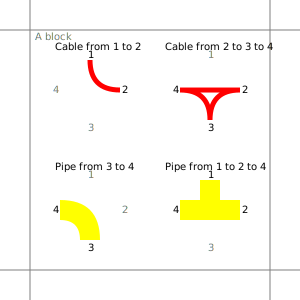
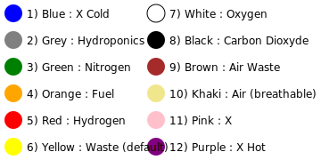
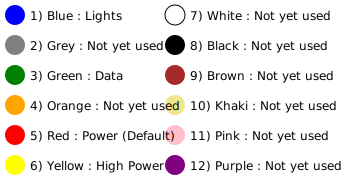

# Stationeers Automation Repository Rules

## Diagrams

- Diagrams are in svg format.
- Diagrams are in the `Diagrams` folder.
- Diagrams are named with the name of the system and formatted in PascalCase (eg. `SystemName.svg`).
- Diagrams are in subfolders named after the category of the system documented (eg. `Energy/SolarPanelTracker.svg` or `Atmospheric/BreathableAirStation.svg` ).
- A specific part of a diagram is named with the name of the part and available in `Parts` subdirectory (eg. `Parts/Cable.svg`). The title and the main group id in definitions must be the same as the file name (eg. `Cable`).
- Diagrams use a grid of 4 elements per cell. Each element has a size of 60x60 pixels. A cell represent the size of a block in the game.
- Diagrams has a background color of `#f5f5f5` aka `whitesmoke`.
- Each part of the diagram is in a group or sorrounded by a comment with the name of the part (eg. `<!-- Cable start -->` and `<!-- Cable end -->`).

### Connection

Cables and Pipes are named relative to their connection to nearby elements (eg. `cable-simple-123` is a simple cable connected to the points 1, 2 and 3). Numbers denote their clockwise position (1 is the top, 2 is the right, 3 is the bottom and 4 is the left).



### Color

Pipes respect a precise color according to the gas they carry.



Cables respect a precise color according to their utility.



## Documentations

- Documentations are in markdown format.
- Documentations are in english (obviously).
- Documentations are in the `Documentations` folder.
- Documentations are named with the name of the system and formatted in PascalCase (eg. `SystemName.md`).
- Documentations are in subfolders named after the category of the system documented (eg. `Energy/SolarPanelTracker.md` or `Atmospheric/BreathableAirStation.md` ).

### Exemple

```markdown
# System Name
## Introduction
Introduction of the system.
## Scripts
### Script Name
Description of the script.
Introduction to devices connected and different states of IC (Settings).
## Diagrams
### Diagram name or directely the diagram if only one
Description of the diagram.
```

## Scripts

- Scripts are in text format.
- Scripts are in english (obviously).
- Scripts are in the `Scripts` folder.
- Scripts are named with the name of the system and formatted in PascalCase (eg. `SystemName`).
- Scripts are in subfolders named after the category of the system documented (eg. `Energy/SolarPanelTracker` or `Atmospheric/BreathableAirStation` ).
- A specific part of a script (eg. snippets) is available in `Parts` subdirectory (eg. `Parts/Cable.svg`). The title and the main group id in definitions must be the same as the file name (eg. `Cable`).

### Code style

- Defines are in screaming snake case (eg. `define ROOM_PRESSURE 101`).
- Aliases for devices are in PascalCase (eg. `alias ActiveVent d0`).
- Aliases for registers are in CamelCase (eg. `alias activeVentStatus r0`).
- Labels are in CamelCase (eg. `goodPressure:`).
- The script start with defines then aliases then the main code.
- The first label (usually `start:`) is followed by a `yield` instruction to simplify jumps from multiple points.
- Defines and aliases are named with an explicit name (eg. `define ROOM_PRESSURE 101` instead of `define P 101`).
- Defines and aliases are named with decreasing granularity (eg. `define ROOM_PRESSURE 101` instead of `define PRESSURE_ROOM 101`).

### Exemple

```MIPS
define ROOM_PRESSURE 101

alias ActiveVent d0
alias GasAnalyzer d1

alias activeVentStatus r0
alias roomPressure r1

start:
yield

l roomPressure GasAnalyzer Pressure
slt activeVentStatus roomPressure ROOM_PRESSURE

s ActiveVent On activeVentStatus

j start
```
